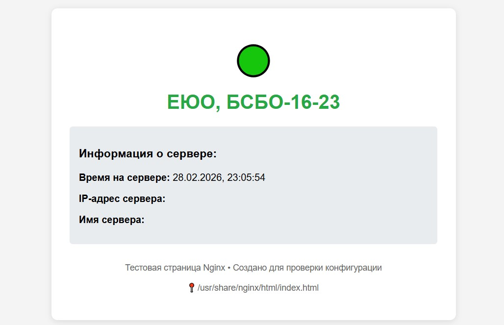
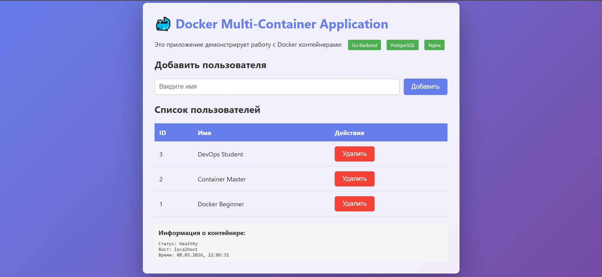
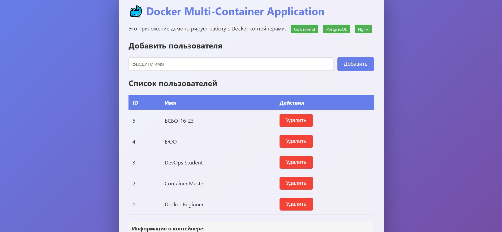
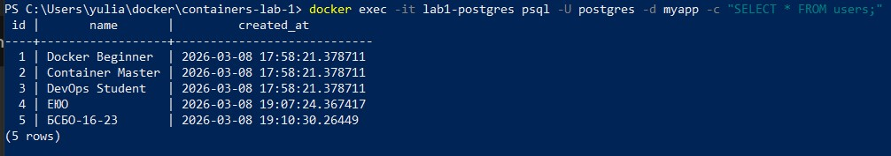

# Отчет по практической работе №1
## Студент: ЕЮО
## Группа: БСБО-16-23
## Дата выполнения: 28.02.2026
### 1. Выполненные команды Docker
#### 1.1 Работа с образами
```
                                                                                     i Info →   U  In UseIMAGE                                                    ID             DISK USAGE   CONTENT SIZE   EXTRAdevprom/alm-app:latest                                   6b3aecab4185       2.59GB          715MB
devprom/math:latest                                      de9fd3d2e732       1.67GB          364MB
docker/desktop-kubernetes:kubernetes-v1.34.1-cni-v1.7…   12d6673564e0        591MB          184MB
docker/desktop-storage-provisioner:v2.0                  115d77efe6e2       59.2MB         17.3MB    U
docker/desktop-vpnkit-controller:dc331cb22850be0cdd97…   7ecf567ea070         47MB         10.8MB    U
jgraph/drawio:latest                                     c1e03149ba0d       1.33GB          407MB
jull9090/taski_backend:latest                            b56f5b914b7c       1.66GB          417MB
jull9090/taski_frontend:latest                           ad65aa461269       2.19GB          507MB
kittygram_final2-backend:latest                          bec6a52dc71d        760MB          181MB
kittygram_final2-frontend:latest                         9f7c4ab9f507       2.13GB          496MB
kittygram_final2-gateway:latest                          edd67418f0f1        214MB           57MB
mariadb:10.7                                             9a48ac9f196f        539MB          122MB
nginx:alpine                                             1d13701a5f9f       92.5MB           26MB
nginx:latest                                             553f64aecdc3        225MB         59.8MB
plantuml/plantuml-server:latest                          cd3d67a3150a        844MB          288MB
postgres:13                                              4689940c6838        618MB          156MB
postgres:13.10                                           8f81e1428679        536MB          137MB    U
registry.k8s.io/coredns/coredns:v1.12.1                  e8c262566636        101MB         22.4MB    U
registry.k8s.io/etcd:3.6.4-0                             e36c08168342        273MB         74.3MB    U
registry.k8s.io/kube-apiserver:v1.34.1                   b9d7c117f8ac        118MB         27.1MB    U
registry.k8s.io/kube-controller-manager:v1.34.1          2bf47c1b01f5        101MB         22.8MB    U
registry.k8s.io/kube-proxy:v1.34.1                       913cc83ca0b5        102MB           26MB    U
registry.k8s.io/kube-scheduler:v1.34.1                   6e9fbc4e25a5       73.5MB         17.4MB    U
registry.k8s.io/pause:3.10                               ee6521f290b2       1.06MB          318kB    U
registry.k8s.io/pause:3.10.1                             278fb9dbcca9       1.06MB          318kB
taski_backend:latest                                     b8e46058aa83       1.67GB          420MB    U
taski_frontend:latest                                    3e1b7152a213       2.19GB          507MB
```
#### 1.1 Работа с образами (Практическое задание)
Найдите образ PostgreSQL версии 15 и golang
версии 1.21 с минимальным размером (alpine), скачайте его
```
                                                                                                    i Info →   U  In Use
IMAGE                                                                   ID             DISK USAGE   CONTENT SIZE   EXTRA
devprom/alm-app:latest                                                  6b3aecab4185       2.59GB          715MB
devprom/math:latest                                                     de9fd3d2e732       1.67GB          364MB
docker/desktop-kubernetes:kubernetes-v1.34.1-cni-v1.7.1-critools-v1.…   12d6673564e0        591MB          184MB
docker/desktop-storage-provisioner:v2.0                                 115d77efe6e2       59.2MB         17.3MB    U
docker/desktop-vpnkit-controller:dc331cb22850be0cdd97c84a9cfecaf44a1…   7ecf567ea070         47MB         10.8MB    U
golang:1.21-alpine                                                      2414035b086e        337MB         70.9MB
jgraph/drawio:latest                                                    c1e03149ba0d       1.33GB          407MB
jull9090/taski_backend:latest                                           b56f5b914b7c       1.66GB          417MB
jull9090/taski_frontend:latest                                          ad65aa461269       2.19GB          507MB
kittygram_final2-backend:latest                                         bec6a52dc71d        760MB          181MB
kittygram_final2-frontend:latest                                        9f7c4ab9f507       2.13GB          496MB
kittygram_final2-gateway:latest                                         edd67418f0f1        214MB           57MB
mariadb:10.7                                                            9a48ac9f196f        539MB          122MB
nginx:alpine                                                            1d13701a5f9f       92.5MB           26MB
nginx:latest                                                            553f64aecdc3        225MB         59.8MB
plantuml/plantuml-server:latest                                         cd3d67a3150a        844MB          288MB
postgres:13                                                             4689940c6838        618MB          156MB
postgres:13.10                                                          8f81e1428679        536MB          137MB    U
postgres:15-alpine                                                      fceb6f86328c        392MB          109MB
registry.k8s.io/coredns/coredns:v1.12.1                                 e8c262566636        101MB         22.4MB    U
registry.k8s.io/etcd:3.6.4-0                                            e36c08168342        273MB         74.3MB    U
registry.k8s.io/kube-apiserver:v1.34.1                                  b9d7c117f8ac        118MB         27.1MB    U
registry.k8s.io/kube-controller-manager:v1.34.1                         2bf47c1b01f5        101MB         22.8MB    U
registry.k8s.io/kube-proxy:v1.34.1                                      913cc83ca0b5        102MB           26MB    U
registry.k8s.io/kube-scheduler:v1.34.1                                  6e9fbc4e25a5       73.5MB         17.4MB    U
registry.k8s.io/pause:3.10                                              ee6521f290b2       1.06MB          318kB    U
registry.k8s.io/pause:3.10.1                                            278fb9dbcca9       1.06MB          318kB
taski_backend:latest                                                    b8e46058aa83       1.67GB          420MB    U
taski_frontend:latest                                                   3e1b7152a213       2.19GB          507MB
```
#### 1.2 Работа с контейнерами
```
PS C:\Users\yulia\docker\containers-lab-1> docker ps -a
CONTAINER ID   IMAGE            COMMAND                  CREATED          STATUS                          PORTS                                     NAMES
ce77b0637b6e   nginx:alpine     "/docker-entrypoint.…"   27 seconds ago   Up 28 seconds                   0.0.0.0:8080->80/tcp, [::]:8080->80/tcp   web-server
7fddf9856566   alpine:latest    "sh"                     3 minutes ago    Exited (0) About a minute ago                                             test-alpine
e7a6bca4e702   taski_backend    "gunicorn --bind 0.0…"   3 months ago     Exited (3) 3 months ago                                                   taski_backend_container
97bd6b10a890   postgres:13.10   "docker-entrypoint.s…"   3 months ago     Exited (0) 3 months ago                                                   db
```
#### 1.2 Работа с контейнерами (Практическое задание)
Запустите контейнер с PostgreSQL, задав
пароль через переменную окружения, подключитесь к нему с помощью docker exec и выполните
SQL-запрос SELECT version(); с помощью утилиты psql.
```
PS C:\Users\yulia\docker\containers-lab-1> docker exec -it my-postgres psql -U postgres
psql (15.17)
Type "help" for help.

postgres=# SELECT version();
                                         version
------------------------------------------------------------------------------------------
 PostgreSQL 15.17 on x86_64-pc-linux-musl, compiled by gcc (Alpine 15.2.0) 15.2.0, 64-bit
(1 row)

postgres=# \q
```
#### 1.3 Работа с томами
```
PS C:\Users\yulia\docker\containers-lab-1> docker exec -it new-postgres psql -U postgres -d testdb -c "SELECT * FROM users;"
 id |      name
----+----------------
  1 | EYO BSBO-16-23
(1 row)

PS C:\Users\yulia\docker\containers-lab-1> docker volume ls
DRIVER    VOLUME NAME
local     964e0673841de89c2e35be633fcc1231ed0c6dc223041064d3f117388b48b6fc
local     d8a4954b58e971e985dc4c6b2d8802f5c507167a1cc86d62ac41eed5a2e87d80
local     docker_dbdata
local     f12fce8ee5f222fc38ae6ec06a032316cd69a00f8f11ab464aa22d6a9d2f7915
local     kittygram_final2_media_volume
local     kittygram_final2_pg_data
local     kittygram_final2_static_volume
local     my-app-data
local     pg_data
```
#### 1.3 Работа с томами (Практическое задание)
Создайте том для статических файлов, запустите Nginx с примонтированным томом, скопируйте в него файл index.html с помощью docker cp по пути внутри контейнера /usr/share/nginx/html и проверьте доступность страницы в браузере.

#### 1.4 Сеть в Docker
```
PS C:\Users\yulia\docker\containers-lab-1> docker network ls
NETWORK ID     NAME             DRIVER    SCOPE
cc21115aa102   bridge           bridge    local
e4bd26cd98da   django-network   bridge    local
c997212c94b9   host             host      local
10479ebf6208   my-app-network   bridge    local
8d2aa50efb26   none             null      local
PS C:\Users\yulia\docker\containers-lab-1> docker exec app ping postgres
PING postgres (172.19.0.2): 56 data bytes
64 bytes from 172.19.0.2: seq=0 ttl=64 time=0.319 ms
64 bytes from 172.19.0.2: seq=1 ttl=64 time=0.125 ms
64 bytes from 172.19.0.2: seq=2 ttl=64 time=0.112 ms
64 bytes from 172.19.0.2: seq=3 ttl=64 time=0.132 ms
64 bytes from 172.19.0.2: seq=4 ttl=64 time=0.173 ms
```
#### 1.4 Сеть в Docker (Практическое задание)
Создайте сеть типа bridge, запустите в ней два контейнера (Nginx и PostgreSQL), проверьте их взаимодействие по именам контейнеров (можно сделать ping из контейнера к другому контейнеру через docker exec).
```
PS C:\Users\yulia\docker\containers-lab-1> docker exec nginx-bridge ping pg-bridge
PING pg-bridge (172.20.0.2): 56 data bytes
64 bytes from 172.20.0.2: seq=0 ttl=64 time=0.232 ms
64 bytes from 172.20.0.2: seq=1 ttl=64 time=0.216 ms
64 bytes from 172.20.0.2: seq=2 ttl=64 time=0.175 ms
```
### 2. Скриншоты работающего приложения
#### 2.1 Главная страница

#### 2.2 Добавление пользователя

#### 2.3 Список пользователей в БД

### 3. GitHub Actions
#### 3.1 Успешный запуск workflow

#### 3.2 Опубликованные образы в GHCR

### 4. Выводы
[Опишите, что нового узнали, с какими трудностями столкнулись]
