# Отчет по практической работе №3
## Выполнил: EYO
## Группа: БСБО-16-23
## Дата выполнения: 29.04.2026

### 1. Подготовка узлов

#### 1.1 Версия ОС и настройки

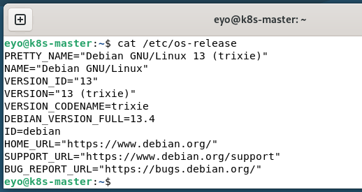

#### 1.2 Отключение swap

k8s-master:
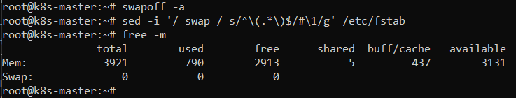

k8s-worker1:
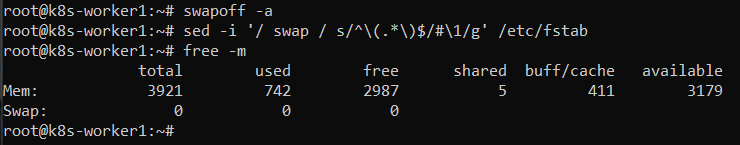

k8s-worker2:
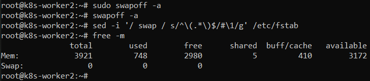

#### 1.3 Модули ядра

k8s-master:
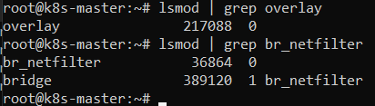

k8s-worker1:
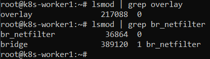

k8s-worker2:
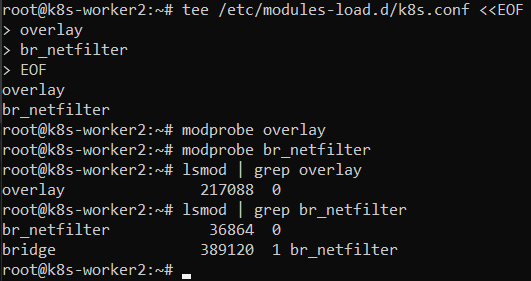

### 2. Установка containerd

#### 2.1 Версия containerd

k8s-master:
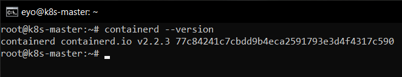

k8s-worker1:
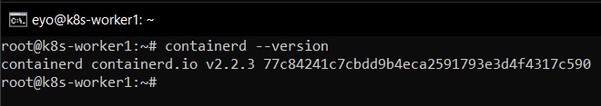

k8s-worker2:
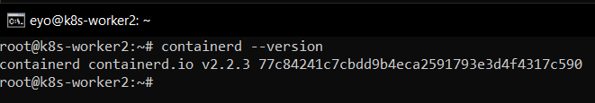

#### 2.2 Конфигурация containerd

k8s-master:
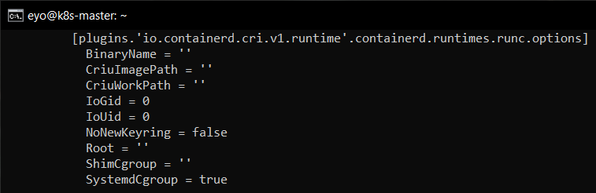

k8s-worker1:
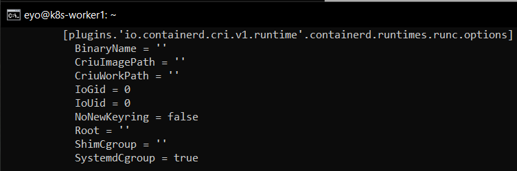

k8s-worker2:
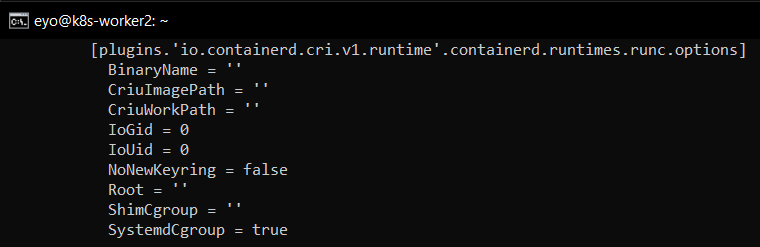

### 3. Установка kubeadm

#### 3.1 Версии компонентов
k8s-master:
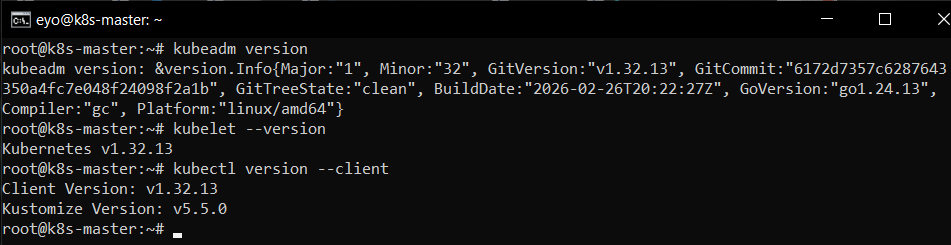

k8s-worker1:
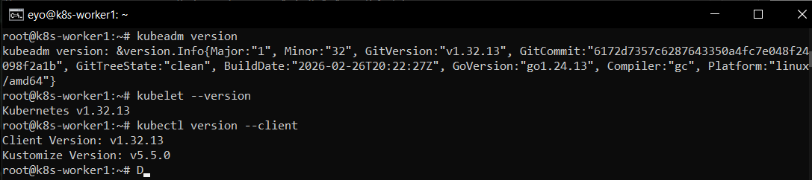

k8s-worker2:
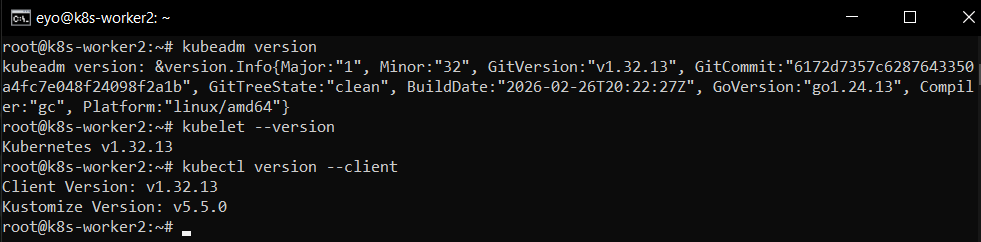

### 4. Инициализация кластера
#### 4.1 Узлы кластера
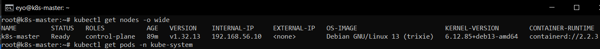

#### 4.2 Поды в namespace kube-system
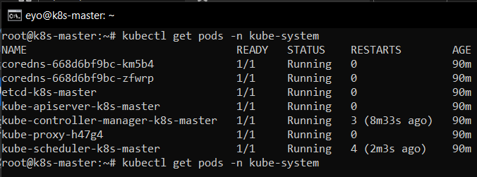

### 5. Сетевые компоненты
#### 5.1 Calico

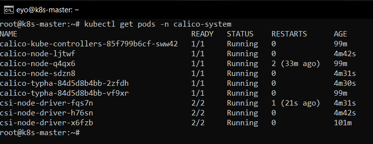

#### 5.2 MetalLB
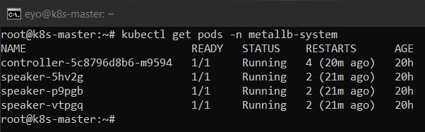

#### 5.3 Ingress Controller
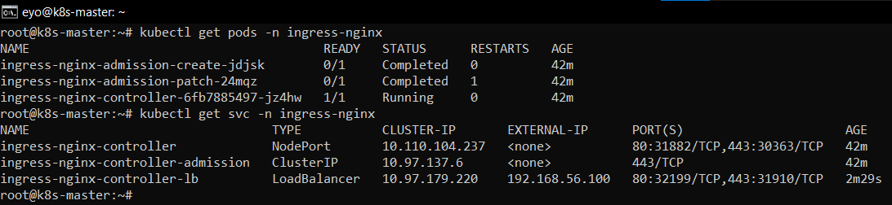

### 6. Развернутое приложение
#### 6.1 Все ресурсы в namespace lab3-app
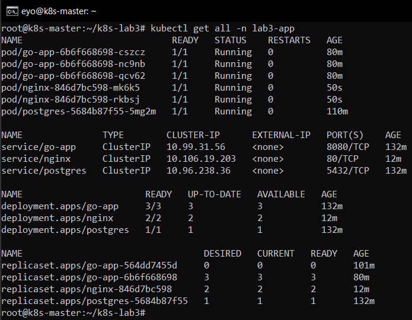

#### 6.2 PersistentVolumeClaim
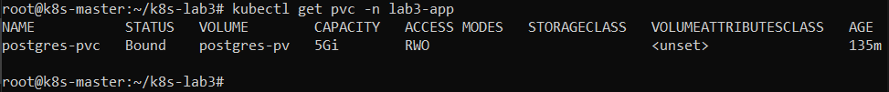

### 7. Скриншоты
#### 7.1 Главная страница приложения
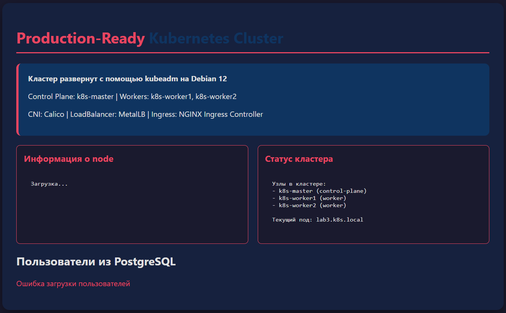
#### 7.2 Дашборд с информацией о поде
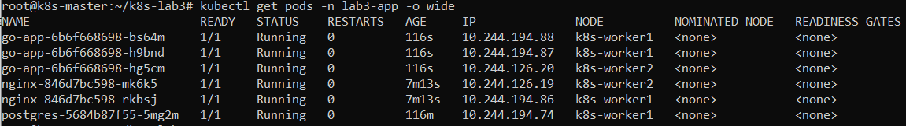

#### 7.3 Список пользователей из БД
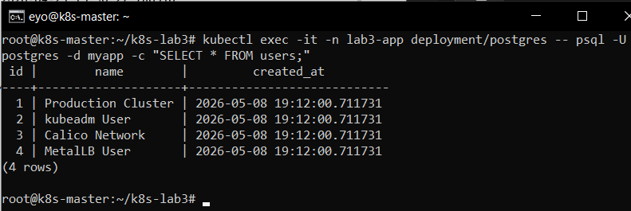

### 8. Тестирование отказоустойчивости
#### 8.1 Симуляция отказа узла
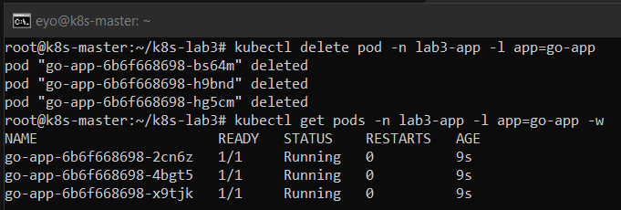

#### 8.2 Проверка сохранности данных
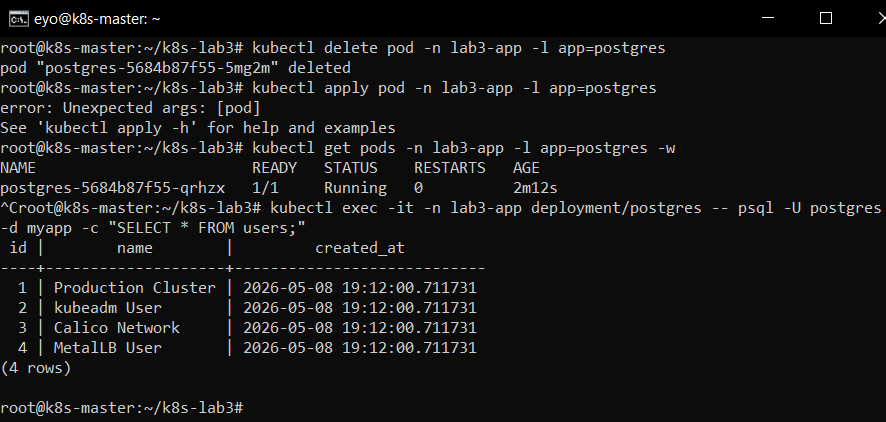

###  9. Ответы на контрольные вопросы

1. **Какие компоненты входят в control plane и какова их роль?**

- kube-apiserver - центральная точка управления кластером. Все компоненты общаются через него.
- etcd - распределенное хранилище.
- kube-sheduler - распределяет поды по узлам, учитывая ресурсы и ограничения.
- kube-controller-manager - следит за желаемым состоянием кластера и исправляет отклонения (перезапускает упавшие поды и тд)
- cloud-controller-manager - интеграция с облачными провайдерами

---
2. **Чем отличается развертывание с kubeadm от использования Minikube?**

|                    | kubeadm                                | Minikube                      |
| ------------------ | -------------------------------------- | ----------------------------- |
| Назначение         | Реальные кластеры                      | Локальная разработка          |
| Узлы               | Несколько физических/виртуальных машин | Один узел на локальной машине |
| Настройка          | Ручная, гибкая                         | Автоматическая                |
| Производительность | Полноценная                            | Ограничена ресурсами ПК       |
| Применение         | Продакшн, учебные кластеры             | Тестирование, обучение        |

---
3. **Для чего нужен CNI-плагин и какую роль выполняет Calico?**

CNI (Container Network Interface) — стандарт для организации сети между подами. Без CNI поды не могут общаться друг с другом.

Calico конкретно обеспечивает:

- маршрутизацию трафика между подами через BGP
- сетевые политики (NetworkPolicy) — можно разрешать/запрещать трафик между подами
- высокую производительность без оверлейных сетей

---
4. **В чем разница между Service типа NodePort, LoadBalancer и Ingress?**

**NodePort** — открывает порт на каждом узле кластера (30000-32767). Простой способ, но неудобен в продакшене — нужно знать IP узла и порт

**LoadBalancer** — запрашивает внешний IP у облака или MetalLB. Каждый сервис получает свой отдельный IP. Удобно, но дорого если сервисов мног

**Ingress** — один внешний IP для всех сервисов, маршрутизация по доменам и путям (`/api` → go-app, `/` → nginx). Самый гибкий вариант для HTTP-трафика

---
5. **Как обеспечивается отказоустойчивость control plane?**

В продакшене control plane делают отказоустойчивым через:

- **Несколько мастер-узлов** (обычно 3 или 5) — если один падает, остальные продолжают работу
- **etcd кластер** — данные реплицируются между узлами, кворум обеспечивает консистентность
- **Виртуальный IP** через keepalived/HAProxy — один общий IP для всех мастеров

### 10. Выводы

В ходе работы я узнала, как устанавливать сетевой плагин Calico, балансировщик нагрузки Metallb и NGINX Ingress Controller для управления внешним доступом. Узнала один из новых способов предоставления внешнего доступа к подам в кластере. Возникли некоторые проблемы: была исправлена кодировка HTML страницы.
